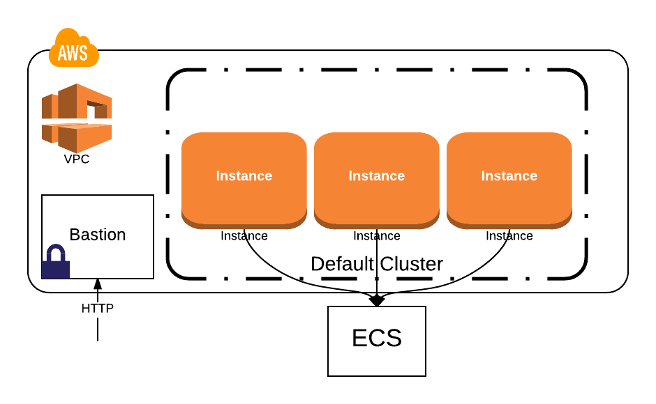
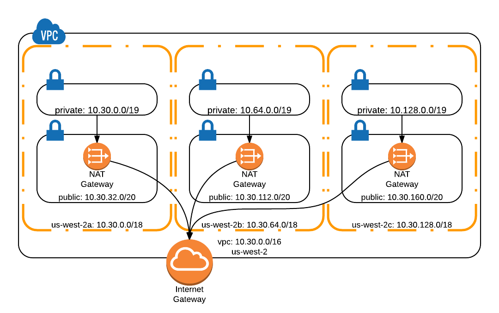
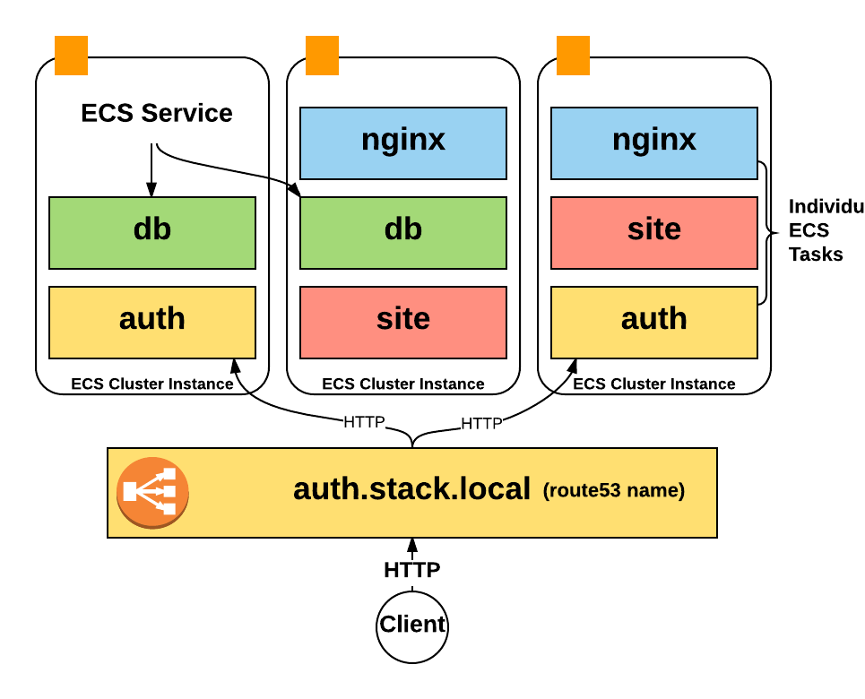

# Segment Stack [](https://circleci.com/gh/segmentio/stack)

[terraform]: https://terraform.io
[remote-state]: https://www.terraform.io/docs/commands/remote-config.html
[aws-credentials]: http://docs.aws.amazon.com/cli/latest/userguide/cli-chap-getting-started.html#cli-quick-configuration
[aws-vault]: https://github.com/99designs/aws-vault
[aws]: http://aws.amazon.com/
[docker-hub]: https://hub.docker.com/
[keypair]: http://docs.aws.amazon.com/AWSEC2/latest/UserGuide/ec2-key-pairs.html#having-ec2-create-your-key-pair

The Segment Stack is a set of [Terraform][terraform] modules for configuring production infrastructure with AWS, Docker, and ECS.
It's a more 'curated' set of defaults for configuring your AWS environment, while still allowing you to fully customize it.

*To get more background on the Segment Stack you can read [this blog post](https://segment.com/blog/the-segment-aws-stack/) about its history.*

The Stack comes with:

- an auto-scaling group of instances to run your services
- a multi-az VPC with different subnets for availability
- self-managed services run via docker and ECS
- an ELB and ECS definition for each service
- docker logs that populate in CloudWatch
- a bastion node for manual SSH access
- automatic ELB logging to S3

Start from scratch or selectively add it to your existing infrastructure, the Stack is yours to customize and tweak.

## Quickstart

_To run the stack, you'll need AWS access and Terraform installed, check out the [requirements](#requirements) section._

The easiest way to get the Stack up and running is by creating a Terraform definition for it, copy this snippet in a file
named `terraform.tf`:
```hcl
module "stack" {
  source      = "github.com/segmentio/stack"
  environment = "prod"
  key_name    = "my-key-name"
  name        = "my-app"
}
```
This is the _base_ configuration, that will provision everything you need to run your services.

From there, you'll want to plan, which will stage the changeset

    $ terraform plan

And if the changes look good, apply them to your infrastructure

    $ terraform apply

This will automatically setup your basic networking configuration with an auto-scaling default cluster running ECS.

Now that we've got all the basics setup, how about adding a service?

Services pull images from Docker Hub and then run the images as containers via ECS. They are automatically discoverable at `<service-name.stack.local>` and will run with zero-downtime deploys.
We can can use the `stack//service` module to automatically provision all of the required parts of the service, including a load balancer, ECS service, and Route53 DNS entry.

Here's a sample service definition, try adding it to your `terraform.tf` file.

```hcl
module "nginx" {
  # this sources from the "stack//service" module
  source          = "github.com/segmentio/stack//service"
  name            = "my-app"
  image           = "nginx"
  port            = 80
  environment     = "${module.stack.environment}"
  cluster         = "${module.stack.cluster}"
  iam_role        = "${module.stack.iam_role}"
  security_groups = "${module.stack.internal_elb}"
  subnet_ids      = "${module.stack.internal_subnets}"
  log_bucket      = "${module.stack.log_bucket_id}"
  zone_id         = "${module.stack.zone_id}"
}
```

Once the nginx service has been added, simply run another plan and apply:

    $ terraform plan
    $ terraform apply

Your service should automatically be up and running. You can SSH into your bastion host (find the ip by running `terraform output`) and connect using the service name:

    $ ssh -i <path-to-key> ubuntu@<bastion-ip>
    $ curl http://nginx.stack.local/

*The bastion IP should have been shown by the terraform output when it created the stack for the first time. If you missed it you can still get it from the AWS console.*

## Requirements

Before we start, you'll first need:

- [ ] an [AWS account][aws] with API access
- [ ] locally configured [AWS credentials][aws-credentials] or a tool like [aws-vault][aws-vault]
- [ ] to [create a keypair][keypair] in AWS
- [ ] Docker images of your services uploaded to [Docker Hub][docker-hub]
- [ ] download and install [terraform][terraform]

## Architecture

At a high level, the Stack creates a multi-az VPC, a single auto-scaling cluster, and service definitions within ECS.



Your instances are automatically distributed across the VPC, addresses are translated by NAT gateways, and services are all discoverable via route53 and ELBs.

We'll walk through how each of these fit together in this architecture document.

### Networking



By default, the Stack will create a VPC in a single region, amongst multiple availability zones (AZs). The default mask for this VPC is

    10.30.0.0/16

The address was chosen to be internal, and to not conflict with other pieces of infrastructure you might run. But, it can also be configured with its own CIDR range.

Each availability zone will get its own external and internal subnets. Most of our infrastructure will live in the *internal* subnet so that they are not externally accessible to the internet.

If you'd like to scale to multiple regions (outside the scope of the current stack), simply add one to the second octet.

    10.31.0.0/16 -- my new region

To span across availability zones, the regional 16-bit mask becomes 18-bits.

    10.30.0.0/18 - AZ A
    10.30.64.0/18 - AZ B
    10.30.128.0/18 - AZ C
    10.30.192.0/18 - Spare

To subdivide each availability zone into spaces for internal, external and to have spare room for growth; use a 19-bit mask for internal, and a 20-bit mask for external. The external space is smaller because only a few instances and load-balancers should be provisioned into it.

    10.30.0.0/18 - AZ A

      10.30.0.0/19 internal
      10.30.32.0/20 external
      10.30.48.0/20 spare

    10.30.64.0/18 - AZ B

      10.30.64.0/19 internal
      10.30.96.0/20 external
      10.30.112.0/20 spare

    10.30.128.0/18 - AZ C

      10.30.128.0/19 internal
      10.30.160.0/20 external
      10.30.176.0/20 spare

The VPC itself will contain a single network gateway to route
traffic in and out of the different subnets. The Stack terraform will automatically create 3 separate [NAT Gateways][nat-gateway] in each of the different subnets.

Traffic from each internal subnet to the outside world will run through the associated NAT gateway.

Alternatively, setting the `use_nat_instances` VPC module variable to true, will use [EC2 NAT instances][nat-instances] instead of the NAT gateway. NAT instances cost less than the NAT gateway, can be shutdown when not in use, and may be preferred in development environments. By default, NAT instances will not use [Elastic IPs][elastic-ip] to avoid a small hourly charge if the NAT instances are not running full time. To use Elastic IPs for the NAT instances, set the `use_eip_with_nat_instances` VPC module variable to true.

For further reading, check out these sources:

- [Recommended Address Space](http://serverfault.com/questions/630022/what-is-the-recommended-cidr-when-creating-vpc-on-aws)
- [Practical VPC Design](https://medium.com/aws-activate-startup-blog/practical-vpc-design-8412e1a18dcc)

[nat-gateway]: http://docs.aws.amazon.com/AmazonVPC/latest/UserGuide/vpc-nat-gateway.html
[nat-instances]: http://docs.aws.amazon.com/AmazonVPC/latest/UserGuide/VPC_NAT_Instance.html
[elastic-ip]: http://docs.aws.amazon.com/AWSEC2/latest/UserGuide/elastic-ip-addresses-eip.html

### Instances


Each instance in an ecs-cluster is provisioned using an AMI built in the `./packer` directory. By default, this AMI is based off the 16.04 Ubuntu LTS image, and runs all the base programs within **systemd**.

After boot, systemd will run each of its targets, which includes booting Docker and the ECS agent. The ECS agent will register the instance with a particular cluster, pulled from the environment variables on the instance.

### Services



Stack services run within ECS. They include a few key pieces:

- an ECS task definition
- an ECS service definition
- an internal ELB
- an internal route53 entry

The task definition tells ECS _what_ docker image to run (nginx), and _how_ to run it (env vars, arguments, etc). The service definition tells ECS how many containers of a task to run, and on which cluster to run the containers. The ELB routes traffic to the containers in a service, and route53 assigns a 'nice' name to the ELB.

Service discovery works via vanilla DNS. Whenever a service is provisioned, it will also create an accompanying ELB that routes to the containers in the service. The route53 entry for the ELB provisioned by the 'auth' service would be:

    $ curl http://auth.stack.local

For more complicated service discovery which handles cases like versioning, we'd recommend using a service like [Consul][consul] or [etcd][etcd].

[consul]: https://www.consul.io/
[etcd]: https://github.com/coreos/etcd

### Bastion

The bastion host acts as the "jump point" for the rest of the infrastructure. Since most of our instances aren't exposed to the external internet, the bastion acts as the gatekeeper for any direct SSH access.

The bastion is provisioned using the key name that you pass to the stack (and hopefully have stored somewhere). If you ever need to access an instance directly, you can do it by "jumping through" the bastion:

    $ terraform output # print the bastion ip
    $ ssh -i <path/to/key> ubuntu@<bastion-ip> ssh ubuntu@<internal-ip>

### Logging

The default AMI that instances of the ECS cluster are running ships with the ecs-agent and a program called ecs-logs pre-configured. While ecs-agent takes care of scheduling services, ecs-logs is in charge of reading the service logs and uploading them to CloudWatch.
This is all configured automatically by the default Stack settings.

ecs-logs creates one CloudWatch Logs Group for each service, then in each of the groups, a CloudWatch Logs Stream named after the docker container running the service will hold all the logs generated by the service.

If you're interested in digging further into how ecs-logs work here is the github repository where it's hosted:

- https://github.com/segmentio/ecs-logs

## Module Reference

To see the full reference for each individual module, see our [reference page](./docs.md).

You can reference modules individually by name:

```hcl
module "vpc" {
  source             = "github.com/segmentio/stack//vpc"
  name               = "${var.name}"
  environment        = "${var.environment}"
  cidr               = "${var.cidr}"
  internal_subnets   = "${var.internal_subnets}"
  external_subnets   = "${var.external_subnets}"
  availability_zones = "${var.availability_zones}"
}
```

## Developing

You can customize any part of the stack you'd like.

### AMIs

All of the default AMIs that ship with stack are build using [packer][packer]. If you'd like to build your own, you can make changes to the `./packer` directory and then re-build using:

    $ make amis

[packer]: https://www.packer.io

### Terraform

Stack is all vanilla Terraform and AWS, so you can customize it by simply forking the repository and referencing your own modules internally.

## Examples

To dig further down into what you can build with the Segment Stack we have put together an example app that shows how to configure a small infrastructure from scratch:

- https://github.com/segmentio/pingdummy

## Authors

- [Calvin French-Owen](https://github.com/calvinfo)
- [Amir Abu Shareb](https://github.com/yields)
- [Achille Roussel](https://github.com/achille-roussel)
- [Kevin Lo](https://github.com/liquidy)
- [Rick Branson](https://github.com/rbranson)

## License

Released under the MIT License

(The MIT License)

Copyright (c) 2016 Segment friends@segment.com

Permission is hereby granted, free of charge, to any person obtaining a copy of this software and associated documentation files (the 'Software'), to deal in the Software without restriction, including without limitation the rights to use, copy, modify, merge, publish, distribute, sublicense, and/or sell copies of the Software, and to permit persons to whom the Software is furnished to do so, subject to the following conditions:

The above copyright notice and this permission notice shall be included in all copies or substantial portions of the Software.

THE SOFTWARE IS PROVIDED 'AS IS', WITHOUT WARRANTY OF ANY KIND, EXPRESS OR IMPLIED, INCLUDING BUT NOT LIMITED TO THE WARRANTIES OF MERCHANTABILITY, FITNESS FOR A PARTICULAR PURPOSE AND NONINFRINGEMENT. IN NO EVENT SHALL THE AUTHORS OR COPYRIGHT HOLDERS BE LIABLE FOR ANY CLAIM, DAMAGES OR OTHER LIABILITY, WHETHER IN AN ACTION OF CONTRACT, TORT OR OTHERWISE, ARISING FROM, OUT OF OR IN CONNECTION WITH THE SOFTWARE OR THE USE OR OTHER DEALINGS IN THE SOFTWARE.
